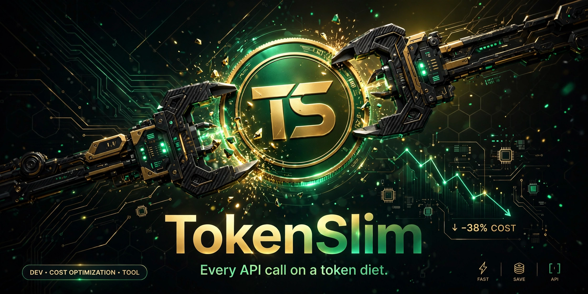

# TokenSlim 

**Trim AI costs without trimming quality.** TokenSlim is a 100% client-side workbench for cutting LLM token spend — compress prompts, route skills without flooding context, cascade models by task difficulty, budget reasoning tokens, cache semantically, and plan spend against a budget. Every saving is tracked on a dashboard. Nothing leaves your browser.

🔗 **Live demo:** https://devilking7x.github.io/tokenslim/

## Features

1. **Prompt Optimizer** — Paste a bloated prompt; a rule-based compressor strips filler phrases ("please", "could you kindly", "as an AI"…), dedupes repeated sentences, collapses whitespace, and rewrites as tight imperative bullets. Real BPE token counts before/after via `gpt-tokenizer`, savings %, word-level diff, and one-click copy. Savings auto-log to the dashboard counter.
2. **Skill Router** — A searchable registry of **350 skills** (35 × 10 categories). The key insight, shown with live math: loading all 350 skill bodies costs ~28k tokens; the router loads the tiny registry and fetches only the 2 bodies you need. 18 full skill bodies ship with the app; the rest load on demand.
3. **Model Cascade** — Pick task complexity (trivial → hard) and get a recommended tier mix. Compare "naive (always flagship)" vs "cascade" costs for 1k / 10k / 100k calls. The cost-per-1M table is seeded with realistic 2026 prices and is **user-editable** (stored in your browser).
4. **Thinking Budget** — Slider from 0–16k reasoning tokens per task; see the cost uplift on a 10k-task sample workload, with an honest explainer of reasoning-token waste.
5. **Semantic Cache** — A localStorage Q&A store. Ask a question; Jaccard similarity on word sets (threshold ~0.45) finds near-duplicates and serves the cached answer with similarity % and tokens saved. Seeded with 7 sample pairs. *Labeled honestly as a local demo of the concept — production would use vector embeddings.*
6. **Budget Planner** — Add tasks (name, input/output token estimates, model tier) and watch totals, projected cost, and a budget meter with warnings at 80% and 100% of your budget.
7. **Savings Dashboard** — Hand-rolled SVG bar charts of per-feature savings, a cumulative tokens-saved counter (localStorage), and weekly activity bars.

## How the 350-skill router works (honest architecture)

- `src/data/skills-registry.json` — **350 lightweight entries** (id, name, category, one-line description, estTokens 40–120), generated deterministically by `scripts/generate-skills.mjs` (`pnpm gen-skills`). This small registry (~30KB) is what always sits in context.
- `src/data/skills/*.md` — **18 full skill bodies** with YAML frontmatter, each 300–800 words of dense, practical guidance. They load on demand via `import.meta.glob(..., { query: '?raw' })` only when you open them.
- The other 332 registry entries show a "full body loads on demand" placeholder — exactly the pattern a production agent router uses: registry in context, bodies fetched on selection.

## Tech stack

TypeScript + React 19 + Vite 7 + Tailwind CSS v4 (via `@tailwindcss/vite`) + lucide-react + `gpt-tokenizer` (real browser BPE counting). Hand-rolled SVG gauges and charts — no chart libraries. All state in localStorage; zero backend.

## Local dev

```bash
pnpm install
pnpm dev        # dev server
pnpm build      # typecheck + production build
pnpm check      # tsc --noEmit
pnpm gen-skills # regenerate the 350-entry skills registry
```

## Deploy

Pushes to `main` deploy to GitHub Pages via `.github/workflows/deploy-pages.yml` (Vite `base: '/tokenslim/'`).

## License

MIT — see [LICENSE](LICENSE).
